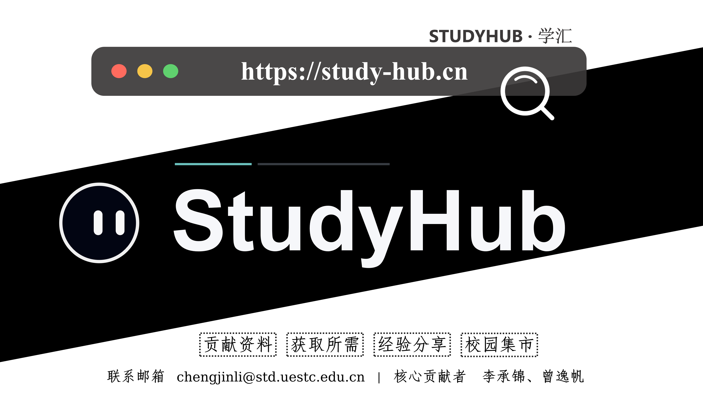

<div align="center">

# StudyHub

**A knowledge-sharing and campus collaboration platform for university students**

[](#tech-stack)
[](#tech-stack)
[](#tech-stack)
[](#tech-stack)
[](#tech-stack)
[](#studyhub-agent)
[](#studyhub-agent)
[](#tech-stack)
[](#studyhub-review-jev)
[](#studyhub-review-jev)
[](https://study-hub.cn)
[](LICENSE)

[Features](#features) | [Quick Start](#quick-start) | [Tech Stack](#tech-stack) | [Agent](#studyhub-agent) | [Content Review](#studyhub-review-jev) | [中文](README.md)

</div>

StudyHub brings together study materials, shared experiences, and campus collaboration. Students can share resources, request materials, help each other, and use a campus marketplace.

**Share knowledge, exchange experience, and make campus resources easier to find.**

---

## Features



| Area | Features |
| --- | --- |
| Study Materials | Upload, browse, and access course materials, revision outlines, and study notes |
| Shared Experiences | Share study strategies, course-selection advice, and campus life insights |
| Resource Requests | Post requests, collaborate, and exchange resources |
| Campus Marketplace | Publish campus listings and second-hand offers |

Website: [study-hub.cn](https://study-hub.cn)

---

## Tech Stack

| Layer | Technologies |
| --- | --- |
| Backend | FastAPI, SQLAlchemy, Pydantic Settings, Uvicorn |
| Frontend | Next.js 14, React, TypeScript |
| Storage | MySQL, SQLite, Alibaba Cloud OSS |
| Caching and Tasks | Redis, BackgroundTasks, standalone workers |
| Async Processing | Selected asynchronous database access and I/O |
| Deployment | Docker Compose, systemd, Nginx |
| Agent | Qwen3.5-4B / 9B, SGLang, tokenizers, a shared Agent runner |
| Content Review | Qwen3Guard-Gen-0.6B, OneJev-4B / 9B, PyTorch, Transformers |

MySQL is used for preview and production environments; SQLite supports local development and quick evaluation.

---

## Repository Structure

```text
studyhub/
  backend/          # Backend services, tests, and operational utilities
  frontend/         # Frontend application and PWA
  studyhub-agent/   # Agent runtime framework
  review-jev/       # Text and image review component
  docs/             # Technical documentation
  reports/          # Technical reports and project retrospectives
  scripts/          # Development, deployment, and operational scripts
```

---

## Quick Start

Use **Python 3.12, Node.js 22, and npm 10**. Version settings are in `.python-version` and `.nvmrc`.

### Docker Development

```bash
bash scripts/dev/docker-dev-up.sh
```

### Lightweight Local Development

```bash
bash scripts/dev/local-dev-up.sh
```

### Module Documentation

| Module | Contents |
| --- | --- |
| [Backend](backend/README.md) | Configuration, APIs, and tests |
| [Frontend](frontend/README.md) | UI development, builds, and PWA |
| [Agent](studyhub-agent/README.md) | Tool calling, runtime contracts, and model inference |
| [Content Review](review-jev/README.md) | Model routing, review APIs, and batch evaluation |
| [Development Scripts](scripts/README.md) | Local startup, deployment, and operations |

---

## API Design

Public APIs follow REST conventions: plural resource names and HTTP methods describe each operation.

| Operation | Endpoint |
| --- | --- |
| Sign In | `POST /api/session` |
| Sign Out | `DELETE /api/session` |
| Download Authorization | `POST /api/materials/{id}/downloads` |

Legacy action-based paths remain available for compatibility. New clients should use the resource endpoints documented in OpenAPI. Agent access, OAuth scopes, and quotas are described in the [MCP documentation](MCP.md).

---

## Development and Deployment

### Pre-Commit Checks

```bash
bash scripts/check-shell-scripts.sh
${STUDYHUB_PYTHON_BIN:-.venv/bin/python} -m ruff check backend/app backend/tests
${STUDYHUB_PYTHON_BIN:-.venv/bin/python} -m pytest backend/tests
npm --prefix frontend run check
npm --prefix frontend run test:unit
```

### Release Checks

```bash
bash scripts/predeploy-check.sh
```

Releases are built and verified separately before switching the active deployment. After initial configuration, run `bash scripts/deploy/atomic-release.sh <commit>` rather than building the frontend in the live directory.

Run `bash scripts/ci-check.sh` for the full local checks. The complete gate includes Playwright critical-path tests against development and production builds. See the [script documentation](scripts/README.md) for deployment configuration and operational commands.

### Production Configuration

FastAPI API documentation is disabled by default in production and preview environments; enable it with `STUDYHUB_DOCS_ENABLED=true` when needed. Configure allowed hosts with `STUDYHUB_TRUSTED_HOSTS` and trusted proxies with `STUDYHUB_TRUSTED_PROXY_IPS` for your deployment.

---

## Contributing

Contributions through Issues and Pull Requests are welcome.

### Primary Contributors

| Contributor | Name |
| --- | --- |
| [@ChengjinLii](https://github.com/ChengjinLii) | 李承锦 |
| [@Sgt-Friedrich](https://github.com/Sgt-Friedrich) | 曾逸帆 |

### Other Contributors

| Contributor | Name |
| --- | --- |
| [@JoeyLam2005](https://github.com/JoeyLam2005) | 林俊宇 |
| [@xiaji](https://github.com/xiaji) | 季文君 |

The original SpringBoot implementation is available in [studyhub-springboot](https://github.com/ChengjinLii/studyhub-springboot), currently an internal repository.

---

## StudyHub Agent

**A tool-calling Agent for university learning workflows.**

[StudyHub Agent](studyhub-agent/README.md) uses Qwen3.5-4B as its primary model for material discovery, preview reading, platform policy queries, and learning memory. It supports standalone 4B / 9B inference and small-to-large model cascading.

| Capability | Implementation |
| --- | --- |
| Tool Calling | A shared runner for search, recommendations, reading, policy queries, and memory access |
| Orchestration | ReAct, citation verification, plan-then-execute, context compaction, and model cascading |
| Citation Checks | `react_verify` checks citations against recorded page reads and provides correction feedback |
| Runtime Contracts | Shared message rendering, call parsing, budget control, and contract hashes |
| Trajectory Recording | Messages, tool evidence, architecture decisions, and model metadata |
| Inference Interfaces | SGLang token-level and OpenAI-compatible clients |

Stack: **Python 3.12, Pydantic, Jinja2, httpx, and SGLang**. See the [Agent documentation](studyhub-agent/README.md) for architecture and usage.

---

## StudyHub Review-Jev

**A content review component for text and image submissions.**

[StudyHub Review-Jev](review-jev/README.md), based on OneJev, reviews materials, experience posts, comments, resource requests, and marketplace listings. It provides compliance risk screening, copyright assistance, and structured review results.

| Content Type | Default Model |
| --- | --- |
| Text Only | Qwen3Guard-Gen-0.6B |
| Images or Text with Images | OneJev-4B |
| Low-Confidence Escalation | OneJev-4B → OneJev-9B → Human Review |

The component includes a **FastAPI service, JSON CLI, configurable rules, and batch evaluation tools**. Checks cover content risks, private information, submission manipulation, copyright declarations, open-license conditions, and reference-content matching. See the [Review-Jev documentation](review-jev/README.md) for routing, request examples, and usage.

---

## Mobile Experience

StudyHub supports PWA installation. Open the website in a mobile browser and use the download arrow in the lower-right corner to start installation. On iPhone, choose "Add to Home Screen" from the share menu. In-app browsers such as WeChat provide guidance for opening the site in a system browser.

The installed app uses the same pages, accounts, and APIs as the website. A Service Worker caches versioned frontend assets and an offline fallback page. Authentication, submissions, downloads, and payments use online services; page updates take effect after old windows are closed.

PWA icons are in `frontend/public/icons/` and can be generated with `node frontend/scripts/build-pwa-icons.mjs`. See the [PWA technical notes](docs/PWA.md) for caching, updates, and acceptance checks.

---

## License

The main StudyHub project uses the [MIT License](LICENSE). Review-Jev uses the [Apache-2.0 license](review-jev/LICENSE).
