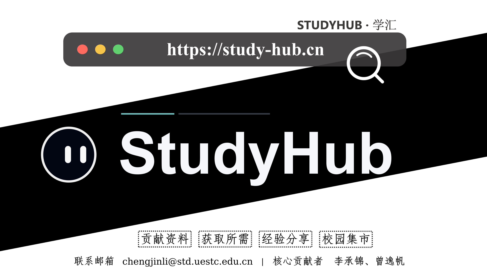

# StudyHub

> StudyHub 是一个面向高校场景的知识共享与校园互助平台，提供资料共享、经验分享、求购协作与校园集市等功能。  
> 官网：https://study-hub.cn

## 核心功能

- 资料共享：课程资料、复习资料与学习笔记上传与浏览
- 经验分享：学习经验、选课建议与校园生活内容沉淀
- 求购协作：支持求购、互助与资源交换
- 校园集市：面向校内场景的二手交易与信息发布

## 技术栈

- 后端：FastAPI、SQLAlchemy、Pydantic Settings、Uvicorn
- 前端：Next.js 14、React、TypeScript
- 数据层：MySQL（preview / production）、SQLite（local-dev / quickstart）
- 存储与缓存：阿里云 OSS 、Redis（可选缓存与锁）
- 任务与异步：BackgroundTasks、独立 worker、局部 async DB 与异步 I/O 路径
- 运维：Docker Compose、systemd、Nginx

## 仓库结构

- `backend/`：FastAPI 后端、测试、fixtures 与运维辅助代码
- `frontend/`：Next.js 前端
- `reports/`：技术报告、项目复盘材料
- `scripts/`：开发、部署、worker 与数据库操作脚本

## 快速开始

- Docker 开发环境：`bash scripts/dev/docker-dev-up.sh`
- 本地轻量启动：`bash scripts/dev/local-dev-up.sh`

具体说明见：

- [backend/README.md](backend/README.md)
- [frontend/README.md](frontend/README.md)
- [scripts/README.md](scripts/README.md)

## 参与贡献

欢迎通过 Issue 和 Pull Request 参与项目改进。

## 核心贡献者

- [@ChengjinLii](https://github.com/ChengjinLii)（李承锦）
- [@Sgt-Friedrich](https://github.com/Sgt-Friedrich)（曾逸帆）

## 其他贡献者

- [@JoeyLam2005](https://github.com/JoeyLam2005)（林俊宇）

## 相关项目

- 初版 SpringBoot 实现：https://github.com/ChengjinLii/studyhub-springboot （当前为内部仓库，暂未开源）

## 未来规划

- 资料审核：逐步完善资料审核、版权风险识别与异常内容处理流程，提升平台内容质量与合规性。
- 语义搜索：为资料、经验分享和求购内容提供更自然的检索体验，减少关键词命中不足的问题。
- MCP 接口：开放面向智能体和开发工具的标准化能力入口，便于后续接入更丰富的自动化工作流。
- 检索与推荐：继续增强资料推荐、贡献榜与校园集市的排序策略，让首页内容更贴近用户当前需求。

## License

本项目采用 [MIT License](LICENSE)。
