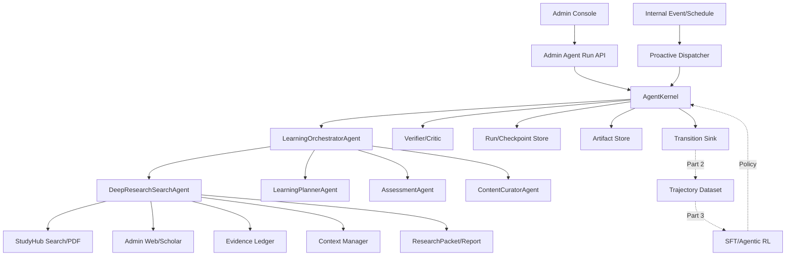

# StudyHub Agentic Learning & DeepResearch Platform

## Codex 完整改造方案书

> **用途**：本文件不是概念介绍，而是交给 Codex 分 PR 实施的工程主协议。
> **阶段范围**：三阶段项目中的第一阶段——Agentic 架构、工具系统、多轮执行、DeepResearch、管理员隔离、主动任务，以及为轨迹数据和 SFT/RL 预留稳定契约。
> **目标仓库**：`ChengjinLii/studyhub`
> **目标路径**：`reports/recagent/agentic-platform/CODEX_IMPLEMENTATION_PLAN.md`
> **版本**：v3.0
> **日期**：2026-07-26

---

# 1. 给 Codex 的总指令

你正在改造 GitHub 仓库：

```text
ChengjinLii/studyhub
```

这不是给现有 Chatbox 增加几个 Tool，而是建设一个新的、管理员专属的：

```text
StudyHub Agentic Learning & DeepResearch Platform
```

最终系统必须具备：

1. 框架无关的 Agent Domain；
2. 可持久、可中断、可恢复的 AgentKernel；
3. 动态规划与重规划；
4. 类型化 Tool、Skill 和受控 Sub-agent；
5. Search-R1 风格 DeepResearchSearchAgent；
6. 内部资料、PDF、Web、Scholar 和 Python Sandbox 工具；
7. Evidence Ledger、Claim–Citation 关系和 ResearchReport；
8. Artifact-first 的学习计划、练习集、日报等业务对象；
9. 事件驱动的后台主动 Agent；
10. Canonical Transition、Token Role 和 Snapshot Environment；
11. 后续 Search-R1、REINFORCE/RLOO、GRPO、GiGPO、TIPS、Rubric/Citation RL 可直接复用的训练契约；
12. 仅 `ROLE_ADMIN` 可访问，普通用户和开发者角色不能访问。

## 1.1 Codex 的工作纪律

Codex 必须遵守：

- 一次只实施本文定义的一个 PR；
- 不在一个 PR 中同时重写运行时、数据库、前端和训练代码；
- 开始编码前先读取指定文件并输出“已理解的现状”和“预计修改文件”；
- 先建立领域契约，再引入 LangGraph；
- 不使用预制 ReAct Agent 作为核心；
- 不把 LangGraph State 当成唯一业务模型；
- 不将 Search-R1 源码整体复制进 StudyHub；
- 不把外部项目作为 Git Submodule；
- 不把外部 Git 仓库源码提交进 StudyHub；
- 外部实现通过 Adapter、HTTP Tool Server 或训练目录集成；
- 不修改普通用户的 AI 接口行为，直到最后切换 PR；
- 不记录或暴露私有 Chain-of-Thought；
- 只记录简短 `rationale_summary`、结构化计划、动作和状态；
- 所有模型输出必须通过 Pydantic Schema；
- 所有业务访问必须经过 Skill/Domain Service；
- 所有管理员路由必须经过后端管理员鉴权；
- 前端隐藏不能代替后端鉴权；
- 所有副作用必须幂等或要求审批；
- 所有新 Schema 都要有 `schema_version`；
- 所有新 Policy、Prompt、Skill Catalog 和 Environment 都要有版本或 Hash；
- 不在第一阶段实现正式 SFT/RL 训练；
- 第一阶段必须产出后续训练所需的事件，而不是在运行时代码中写死 Reward 权重；
- 不声称未运行的测试已通过；
- 不使用测试集调参；
- 不删除失败轨迹；
- 不把 API Key、私有 PDF、用户原始信息和模型权重提交到 Git。

## 1.2 每个 PR 完成后的统一输出

Codex 每次完成一个 PR 后必须输出：

```text
1. 修改文件列表
2. 新增领域模型/接口
3. 核心设计决定
4. 数据库迁移内容
5. 测试命令和真实结果
6. 未通过的测试
7. 向后兼容说明
8. 安全影响
9. 下一 PR 的明确接入点
10. 新增配置及默认值
11. Artifact/Transition Schema 变化
12. 回滚方法
```

---

# 2. 开始前必须阅读 StudyHub

Codex 在 PR 0 开始前必须读取以下文件，不得只看 README：

```text
README.md
backend/README.md
frontend/README.md
scripts/README.md

backend/app/services/ai_service.py
backend/app/services/agent_tool_loop_service.py
backend/app/services/agent_safety_service.py
backend/app/services/material_pdf_evidence_service.py
backend/app/services/worker_service.py

backend/app/api/routes/ai.py
backend/app/api/deps.py

backend/app/core/config.py
backend/app/core/db.py
backend/app/core/security.py
backend/app/core/observability.py

backend/app/services/read_support.py
backend/app/models/materials.py
backend/app/repos/material_repo.py
backend/app/schemas/ai.py

backend/tests/test_agent_quality_eval.py
```

如果某个路径已移动，使用：

```bash
rg -n "class AiService|AgentToolLoopService|AgentSafetyService|MaterialPdfEvidenceService|WorkerService"
rg -n "ROLE_ADMIN|ROLE_DEVELOPER|require_privileged_auth_context"
rg -n "APIRouter.*admin|include_router"
rg -n "Base =|DeclarativeBase|alembic|migration"
rg -n "worker|run_named_job"
```

先定位真实代码，不要凭方案书猜测仓库结构。

## 2.1 已知平台基础

当前平台已经使用：

- FastAPI；
- SQLAlchemy；
- Pydantic Settings；
- MySQL/SQLite；
- Redis；
- OSS/local storage；
- 独立 Worker；
- REST API；
- Next.js 管理端；
- 角色位掩码；
- 当前 AI 推荐和 SSE；
- 页级 PDF Evidence；
- 资料权限和 Safety Service。

新平台必须复用这些基础设施，不重新创建第二套 Web 后端、用户系统或文件系统。

---

# 3. 外部仓库学习协议

## 3.1 统一目录

不得把外部项目放入业务目录。使用：

```text
.local-research/vendor/
```

该目录必须加入 `.gitignore`。

所有版本记录在：

```text
ml/agentic_platform/vendor/
reports/recagent/agentic-platform/references/vendor-lock.yaml
```

## 3.2 同步方法

Codex 在 PR 0 中新增：

```text
scripts/research/sync-agentic-vendors.sh
```

脚本行为：

1. 读取 `vendor-lock.yaml`；
2. Clone 到 `.local-research/vendor/<name>`；
3. Checkout 指定 Commit SHA；
4. 验证 License 文件存在；
5. 输出实际 Commit；
6. 不修改外部仓库；
7. 不执行外部安装脚本；
8. 不复制源码到 StudyHub；
9. 未填写 Commit SHA 时拒绝继续。

## 3.3 学习笔记

Codex 必须创建：

```text
reports/recagent/agentic-platform/references/learning-notes.md
```

每个外部项目记录：

```text
- 读了哪些文件
- 学到了什么接口
- StudyHub 采用什么
- StudyHub 明确不采用什么
- License
- Commit SHA
- 可能的版本风险
```

---

# 4. 外部仓库与论文的阅读顺序

下面不是“参考链接列表”，而是 Codex 的课程表。

---

## 4.1 Search-R1：核心行为协议与历史基线

### 仓库

```text
https://github.com/PeterGriffinJin/Search-R1
```

### 论文

```text
Search-R1: Training LLMs to Reason and Leverage Search Engines with Reinforcement Learning
https://arxiv.org/abs/2503.09516

An Empirical Study on Reinforcement Learning for Reasoning-Search Interleaved LLM Agents
https://arxiv.org/abs/2505.15117
```

### Codex 必须阅读

```text
README.md
docs/retriever.md
docs/experiment_log.md
scripts/data_process/nq_search.py
search_r1/search/retriever_server.py
search_r1/search/
infer.py
train_ppo.sh
```

如果路径变化，使用：

```bash
find . -maxdepth 4 -iname '*retriev*' -o -iname '*agent*' -o -iname '*reward*'
rg -n "search|retriev|observation|mask|reward|rollout"
```

### 必须学习

- Reasoning 与 Search Tool 交错；
- 独立 Retriever Server；
- 多轮 Search；
- Search Corpus 格式；
- Tool Observation 进入后续上下文；
- Retrieved Token 不参与策略更新；
- Outcome/Format Reward；
- 训练数据中的 `data_source/prompt/ability/reward_model/extra_info`；
- Search Engine 对训练动态的影响。

### 不得照搬

- 旧版 Python、Torch、vLLM 和 veRL Pin；
- Wikipedia 数据路径；
- 原始字符串标签协议；
- 只面向最终 QA 的状态模型；
- 在产品后端内直接启动训练。

### StudyHub 用途

```text
DeepResearchSearchAgent 的行为基线
Search-R1-compatible Dataset Adapter
Search-R1-compatible Retriever Adapter
Part 3 的历史 RL Baseline
```

---

## 4.2 veRL：实际 Agentic RL 基础设施

### 仓库

```text
https://github.com/volcengine/verl
```

### Codex 必须阅读

```text
docs/start/agentic_rl.rst
docs/advance/fully_async.md
recipe/retool/
verl/experimental/agent_loop/
```

路径变化时搜索：

```bash
rg -n "ToolAgentLoop|AgentLoop|multi_turn|fully_async|partial_rollout"
```

### 必须学习

- Server-based Async Rollout；
- Actor/Agent/Environment 分离；
- Multi-turn Tool Calling；
- Agent Loop；
- Partial Rollout；
- 中断和恢复；
- GPU 在 Tool 等待期间避免空闲；
- Rollout 数据落盘。

### StudyHub 用途

第一阶段只提供 Adapter 接口。第三阶段训练使用最新版 veRL，而不是 Search-R1 仓库中的旧训练栈。

---

## 4.3 VerlTool：多工具 Environment 和 Step Record

### 仓库

```text
https://github.com/TIGER-AI-Lab/verl-tool
```

### 论文

```text
VerlTool: Towards Holistic Agentic Reinforcement Learning with Tool Use
https://arxiv.org/abs/2509.01055
```

### Codex 必须阅读

```text
README.md
verl_tool/agent_loop/verltool_agent_loop.py
verl_tool/trainer/ppo/ray_trainer.py
examples/
benchmarks/
```

### 必须学习

- Tool-as-environment；
- 每条轨迹保存独立 Environment State；
- 多工具统一 API；
- Async Trajectory Rollout；
- Token-in/Token-out，避免重新 Tokenize；
- Step Record；
- Tool/Non-tool 混合训练；
- DAPO 等 Recipe 可插拔。

### StudyHub 用途

```text
AgentEnvironment Adapter
Tool Server Contract
Token Role/Mask Contract
Rollout Record Contract
```

不得把 VerlTool 用作线上产品运行时。

---

## 4.4 DeepResearcher：真实搜索环境

### 仓库

```text
https://github.com/GAIR-NLP/DeepResearcher
```

### 论文

```text
DeepResearcher: Scaling Deep Research via Reinforcement Learning in Real-world Environments
https://arxiv.org/abs/2504.03160
```

### Codex 必须阅读

```text
README.md
scrl/handler/
signal/
evaluate/
train_grpo.sh
```

### 必须学习

- Search Handler 与 Trainer 分离；
- 真实 Web 环境的不确定性；
- Planning、Cross-validation、Self-correction；
- 无法找到结果时诚实终止；
- 真实搜索和固定 RAG 环境的差异。

### StudyHub 用途

外部 Web/Scholar Tool 和真实环境 Fault Model 的参考。

---

## 4.5 DR Tulu：完整 SFT、Agent Backend 和 Rubric RL

### 仓库

```text
https://github.com/rlresearch/dr-tulu
```

### 论文

```text
DR Tulu: Reinforcement Learning with Evolving Rubrics for Deep Research
https://arxiv.org/abs/2511.19399
```

### Codex 必须阅读

```text
README.md
agent/README.md
agent/
sft/llama-factory/README.md
rl/open-instruct/README.md
```

### 必须学习

- MCP Tool Backend；
- 高并发异步请求；
- Long-form DeepResearch Agent；
- SFT 管线；
- Evolving Rubrics；
- 开放式 Research Report 评测。

### StudyHub 用途

- 管理员内部 Tool Server；
- Long-form ResearchReport；
- 第二阶段 Rubric 数据；
- 第三阶段开放式 SFT/RL。

不直接采用其 GRPO 作为唯一算法。

---

## 4.6 CaRR：Citation-aware Rubric

### 仓库

```text
https://github.com/THUDM/CaRR
```

### 论文

```text
Chaining the Evidence: Robust Reinforcement Learning for Deep Search Agents with Citation-Aware Rubric Rewards
https://arxiv.org/abs/2601.06021
```

### Codex 必须阅读

```text
README.md
deepsearch_rm_with_rubrics/
tool_server/
scripts/training/
scripts/eval/
```

### 必须学习

- Atomic Rubric；
- Entity Identification；
- Citation Grounding；
- Evidence Connectivity；
- Reward Model Server；
- SFT Trajectory 与 RL QA/Rubric 分离。

### StudyHub 用途

第一阶段实现 Evidence Ledger、Claim ID、Citation Link 和 Citation Verifier，确保第三阶段可以构建 Citation Reward。

---

## 4.7 GiGPO：多轮 Agent 的层次化信用分配

### 论文

```text
Group-in-Group Policy Optimization for LLM Agent Training
https://arxiv.org/abs/2505.10978
```

### 必须学习

- Episode-level Macro Relative Advantage；
- Anchor State Grouping；
- Step-level Micro Relative Advantage；
- Critic-free；
- 不增加额外 Rollout；
- 状态等价性是核心前提。

### StudyHub 用途

第一阶段必须记录：

```text
state_before_hash
state_abstract_key
task_family
plan_step_type
constraint_bucket
evidence_bucket
budget_bucket
```

否则第三阶段无法做 State Grouping。

---

## 4.8 TIPS 与 IGPO：信息增益式 Turn Reward

### 论文

```text
TIPS: Turn-Level Information-Potential Reward Shaping for Search-Augmented LLMs
https://arxiv.org/abs/2603.22293

Information Gain-based Policy Optimization
https://arxiv.org/abs/2510.14967
```

### 必须学习

- Turn 作为 Reason + Action + Observation 段；
- Outcome Reward 过稀疏；
- 计算信息潜力变化；
- Potential-based Shaping；
- Policy 自身或 Teacher 的 Belief Change。

### StudyHub 用途

第一阶段不计算最终 Reward，但必须记录：

```text
evidence_added
constraint_delta
milestone_delta
candidate_rank_delta
information_potential_inputs
```

---

## 4.9 Search-R1++ 实证研究：不要绑定 GRPO

### 论文

```text
How to Train Your Deep Research Agent? Prompt, Reward, and Policy Optimization in Search-R1
https://arxiv.org/abs/2602.19526
```

### 必须学习

该论文在其 Search-R1 实验设置中报告：

- Fast Thinking Prompt 更稳定；
- 简单 F1 Reward 可能导致回答规避；
- Action-level Penalty 可缓解；
- REINFORCE 优于 PPO；
- GRPO 稳定性最差。

这不是所有任务的普遍定律，但足以说明：

```text
StudyHub 运行时不得绑定 GRPO
Transition 格式不得绑定 Group Sampling
Trainer Adapter 必须支持 REINFORCE/RLOO、PPO、GRPO、GiGPO
```

---

## 4.10 SimpleTIR：多轮工具训练稳定性

### 论文

```text
SimpleTIR: End-to-End Reinforcement Learning for Multi-Turn Tool-Integrated Reasoning
https://arxiv.org/abs/2509.02479
```

### 必须学习

- Tool Feedback 引发分布漂移；
- Void Turn；
- 异常梯度；
- 过滤损坏轨迹；
- 不将失败数据静默删除。

### StudyHub 用途

第一阶段定义：

```text
void_turn
invalid_action
observation_corrupted
trainable
quarantine_reason
```

---

## 4.11 长上下文方法

### 论文

```text
LongSeeker: Elastic Context Orchestration for Long-Horizon Search Agents
https://arxiv.org/abs/2605.05191

ContextBudget: Budget-Aware Context Management for Long-Horizon Search Agents
https://arxiv.org/abs/2604.01664
```

### 必须学习

- Context 本身是 Agent 可操作资源；
- Compress、Skip、Rollback、Snippet、Delete；
- Context Budget 是序列决策；
- 不应将全部 Observation 永久堆入 Prompt。

### StudyHub 用途

第一阶段提供：

```text
research.compress_context
research.create_snippet
research.rollback_branch
research.drop_observation
```

原始 Observation 始终在 Artifact 中保留。

---

## 4.12 CoSearch：Retriever 联合优化

### 论文

```text
CoSearch: Joint Training of Reasoning and Document Ranking via Reinforcement Learning for Agentic Search
https://arxiv.org/abs/2604.17555
```

### 必须学习

- 固定 Retriever 可能成为瓶颈；
- Reasoning Agent 与 Ranker 分离；
- Query 语义分组；
- 立即 Ranking Signal + 长期 Outcome Signal。

### StudyHub 用途

只作为第三阶段 Stretch。第一阶段必须给 Retriever 返回：

```text
retriever_version
candidate_ids
raw_scores
reranker_scores
query_embedding_ref
```

---

# 5. 最终技术选型

```text
业务领域：
  StudyHub 自研 Agent Domain

产品运行时：
  LangGraph v1 低层 StateGraph

结构化契约：
  Pydantic v2

模型接口：
  AgentModelProvider
  AgentPolicy

Checkpoint：
  local/test → InMemory/SQLite
  preview/research → Redis
  权威摘要 → MySQL

Artifact：
  MySQL 元数据
  OSS/local FS 大文件

DeepResearch：
  Search-R1 行为协议
  StudyHub 自研子图和工具

训练：
  最新 veRL AgentLoop
  VerlTool Adapter

SFT：
  LLaMA-Factory 或 veRL SFT，第三阶段决定

RL：
  REINFORCE/RLOO 低成本基线
  GRPO 历史可比基线
  GiGPO/TIPS 主研究路线
  Rubric/Citation Reward
```

---

# 6. 管理员专属安全边界

## 6.1 角色

新建严格依赖：

```python
def require_admin_agent_context(
    auth: AuthContext = Depends(require_auth_context),
) -> AuthContext:
    if not has_role(auth.role_mask, ROLE_ADMIN):
        raise HTTPException(
            status_code=403,
            detail="Agentic research platform is admin-only",
        )
    return auth
```

不得使用当前允许 Admin 或 Developer 的宽松鉴权。

## 6.2 路由

仅允许：

```text
/api/admin/agent-runs
/api/admin/agent-threads
/api/admin/agent-artifacts
/api/admin/agent-scenarios
/api/admin/deep-research
/api/admin/agent-evaluations
/api/admin/agent-jobs
```

不得注册到：

```text
/api/ai-recommendations
/api/ai-chats
公开 MCP
普通用户菜单
```

## 6.3 Shadow Mode

第一阶段主动功能只能：

```text
生成 Artifact
→ 管理员预览
```

不得直接向普通学生发送提醒、修改计划或生成可见内容。

## 6.4 外部网络

默认：

```text
STUDYHUB_DEEP_RESEARCH_WEB_ENABLED=false
STUDYHUB_DEEP_RESEARCH_SCHOLAR_ENABLED=false
STUDYHUB_DEEP_RESEARCH_PYTHON_ENABLED=false
```

启用时必须：

- 域名 Allowlist；
- SSRF 防护；
- 私网 IP 拒绝；
- 下载限制；
- MIME 检查；
- Prompt Injection 清洗；
- Tool Secret 不进入模型 Context；
- Python 使用 SandboxFusion/隔离容器；
- 所有外部域名写审计。

---

# 7. 统一文件结构

```text
reports/recagent/agentic-platform/
├── CODEX_IMPLEMENTATION_PLAN.md
├── architecture/
├── contracts/
├── training/
├── evaluation/
├── references/
└── prompts/

backend/app/agentic_platform/
├── domain/
├── runtime/
├── policy/
├── skills/
├── subagents/
├── deepresearch/
├── verification/
├── persistence/
├── proactive/
├── simulation/
└── application/

ml/agentic_platform/
├── vendor/
├── adapters/
├── data/
├── simulation/
├── trajectory/
├── sft/
├── rl/
├── reward/
├── evaluation/
└── configs/

.local-research/vendor/      # gitignored
artifacts/agentic_platform/  # gitignored
```

---

# 8. 目标架构



---

# 9. Agent Domain 契约

所有模型都使用：

```python
model_config = ConfigDict(extra="forbid")
```

## 9.1 AgentTaskState

至少包含：

```python
class AgentTaskState(BaseModel):
    schema_version: str

    thread_id: str
    run_id: str
    user_id: int | None
    admin_actor_id: int

    trigger: TriggerContext
    goal: GoalState
    constraints: list[ConstraintState]
    milestones: list[MilestoneState]

    plan: AgentPlan
    working_set: WorkingSet

    learner_ref: ArtifactRef | None
    research_memory_ref: ArtifactRef | None
    active_artifacts: list[ArtifactRef]

    environment: EnvironmentRef
    budget: AgentBudget

    pending_user_request: UserInputRequest | None
    pending_approval: ApprovalRequest | None
    pending_event: EventWait | None

    last_transition_id: str | None
    terminal: TerminalState | None
```

## 9.2 Action

```python
class AgentActionType(StrEnum):
    CREATE_PLAN = "create_plan"
    REVISE_PLAN = "revise_plan"
    EXECUTE_SKILL = "execute_skill"
    DELEGATE = "delegate"
    ASK_USER = "ask_user"
    REQUEST_APPROVAL = "request_approval"
    WAIT_EVENT = "wait_event"
    WRITE_ARTIFACT = "write_artifact"
    MANAGE_CONTEXT = "manage_context"
    REVIEW = "review"
    FINALIZE = "finalize"
    ABORT = "abort"
```

## 9.3 AgentDecision

```python
class AgentDecision(BaseModel):
    schema_version: str
    action_type: AgentActionType
    plan_step_id: str | None
    rationale_summary: str
    expected_state_change: ExpectedStateChange

    skill_name: str | None
    arguments: dict[str, Any] | None

    delegate_agent: str | None
    task_packet: SubAgentTaskPacket | None

    user_request: UserInputRequest | None
    approval_request: ApprovalRequest | None
    event_wait: EventWait | None

    final_output: AgentOutput | None
```

使用 `model_validator` 保证不同 Action 所需字段。

## 9.4 StateDelta

Runtime 统一应用：

```text
resolved_constraints
unresolved_constraints
completed_milestones
candidate IDs
accepted/rejected IDs
evidence refs
artifact refs
plan step status
budget consumption
failure records
wait state
terminal state
```

节点不得原地修改 State。

## 9.5 Canonical Hash

- JSON key 排序；
- UTF-8；
- 紧凑分隔符；
- 排除非确定时间；
- 排除 Trace Export 时间；
- 保留业务时间；
- SHA-256；
- 单元测试固定 Golden Hash。

---

# 10. 动态计划

## 10.1 Plan DAG

```python
class AgentPlan(BaseModel):
    plan_id: str
    version: int
    objective: str
    success_criteria: list[str]
    steps: list[PlanStep]
    created_by_policy_version: str
```

```python
class PlanStep(BaseModel):
    step_id: str
    title: str
    status: PlanStepStatus
    depends_on: list[str]
    capability: str
    completion_check: str
    retry_policy: RetryPolicy
    expected_artifacts: list[str]
```

## 10.2 Planner 和 Policy 分离

- Planner：创建/修订多步 Plan；
- Policy：每轮选择一个原子 Action；
- Verifier：确定是否达到里程碑；
- Finalizer：生成对管理员展示的结果。

---

# 11. Tool、Skill、Sub-agent

## 11.1 Tool

原子 I/O，无 Agent Loop。

## 11.2 Skill

可以组合 Tool，但必须：

- Pydantic Input/Output；
- 独立版本；
- 超时；
- 重试；
- 幂等；
- 权限；
- 预算；
- Fixture Executor；
- Snapshot Executor；
- Reward Hook；
- Observation Training Role。

## 11.3 SkillSpec

```python
class SkillSpec(BaseModel):
    name: str
    version: str
    description: str

    input_model: str
    output_model: str

    side_effect: Literal["none", "read", "write", "external"]
    permission_scopes: list[str]
    requires_approval: bool

    timeout_seconds: float
    retry_policy: RetryPolicy
    idempotency: Literal["pure", "keyed", "non_idempotent"]

    observation_training_role: Literal[
        "visible_masked",
        "visible_trainable",
        "hidden",
    ]

    environment_adapter: str
    reward_hooks: list[str]
    cost_model: SkillCost
```

## 11.4 第一批 Skill

```text
materials.search
materials.inspect
materials.read_pdf_evidence
materials.find_question_pages
materials.find_answer_pages
materials.compare

research.search_internal
research.search_web
research.search_scholar
research.read_source
research.extract_claims
research.update_evidence
research.cross_validate
research.manage_context
research.write_report
research.validate_report

learner.load_profile
learner.update_profile
plan.create
plan.revise
practice.compose
brief.generate_daily

validation.check_constraints
validation.check_evidence
validation.check_artifact
```

## 11.5 Sub-agent

第一阶段实现：

```text
DeepResearchSearchAgent
LearningPlannerAgent
AssessmentAgent
ContentCuratorAgent
```

子 Agent：

- 只获得 TaskPacket；
- 不看到完整 Thread；
- 不直接输出给用户；
- 不直接写数据库；
- 返回结构化 Artifact/StateDelta；
- 有自己的 Turn/Tool/Token Budget；
- 每个 Transition 记录 `parent_transition_id/subagent_name`。

---

# 12. DeepResearchSearchAgent

## 12.1 子图

```text
frame_question
→ create_research_plan
→ choose_search_domain
→ search
→ read
→ update_evidence_ledger
→ cross_validate
→ manage_context
→ replan or write_report
→ validate_citations
→ return_research_packet
```

## 12.2 DeepResearchState

```python
class DeepResearchState(BaseModel):
    research_question: str
    outline: list[ResearchSection]
    sub_questions: list[SubQuestion]

    search_history: list[SearchAttempt]
    visited_sources: list[SourceRef]
    evidence_ledger_ref: ArtifactRef

    claims: list[Claim]
    conflicts: list[Conflict]
    unresolved_questions: list[str]
    rejected_paths: list[str]

    remaining_search_turns: int
    remaining_page_reads: int
    remaining_context_tokens: int
```

## 12.3 Evidence Ledger

```python
class EvidenceRecord(BaseModel):
    evidence_id: str
    source_type: str
    source_uri: str
    title: str

    material_id: int | None
    page: int | None
    excerpt: str

    supports_claim_ids: list[str]
    contradicts_claim_ids: list[str]

    reliability: float
    access_scope: str
    retrieved_at: datetime
```

## 12.4 ResearchPacket

```python
class ResearchPacket(BaseModel):
    packet_id: str
    query: str
    sub_questions: list[str]

    claims: list[Claim]
    evidence: list[EvidenceRecord]
    conflicts: list[Conflict]
    unresolved_questions: list[str]

    citation_metrics: CitationMetrics
    source_coverage: dict[str, int]
    confidence: float

    suggested_next_actions: list[str]
    trace_ref: ArtifactRef
```

## 12.5 Context Actions

```text
compress
snippet
rollback
drop
restore_artifact
```

原始 Observation 不删除，只从工作 Context 移出。

---

# 13. LangGraph 运行时

只使用低层 `StateGraph`。

固定节点：

```text
bootstrap
planner
policy
skill_executor
subagent_executor
interrupt
event_wait
verifier
critic
finalizer
artifact_persist
```

固定路由：

```text
START
→ bootstrap
→ planner
→ policy
→ execute/delegate/ask/wait/review/finalize
→ verifier
→ policy/planner/finalize/abort
```

业务计划在 State 中，不将每个业务任务硬编码成 Graph Node。

## 13.1 Checkpoint

```text
测试：InMemory
本地：SQLite
研究环境：Redis
权威 Run/Step 摘要：MySQL
```

Redis 丢失后允许从 MySQL 最近关键 State Snapshot 恢复当前 Step。

---

# 14. 管理员 API

```text
POST   /api/admin/agent-runs
GET    /api/admin/agent-runs/{run_id}
GET    /api/admin/agent-runs/{run_id}/events
POST   /api/admin/agent-runs/{run_id}/resume
POST   /api/admin/agent-runs/{run_id}/cancel

POST   /api/admin/deep-research
GET    /api/admin/deep-research/{run_id}
GET    /api/admin/deep-research/{run_id}/report

GET    /api/admin/agent-artifacts
GET    /api/admin/agent-scenarios
POST   /api/admin/agent-evaluations
GET    /api/admin/agent-jobs
```

SSE 事件：

```text
run.started
plan.created
plan.revised
step.started
skill.started
skill.completed
subagent.started
subagent.completed
context.compressed
artifact.created
user_input.required
approval.required
run.waiting
run.completed
run.failed
```

---

# 15. 数据库

新增表：

```text
agent_threads
agent_runs
agent_steps
agent_waits
agent_jobs
agent_artifacts
```

## 15.1 agent_runs

至少：

```text
id
thread_id
admin_actor_id
trigger_type
trigger_ref
runtime_version
policy_version
environment_snapshot_id
status
current_step_id
checkpoint_ref
started_at
completed_at
terminal_reason
```

## 15.2 agent_steps

```text
id
run_id
step_index
node_name
plan_step_id
subagent_name
status
state_before_hash
state_after_hash
state_abstract_key
action_type
skill_name
observation_ref
artifact_refs_json
started_at
completed_at
error_code
```

## 15.3 Artifact

```text
ResearchPacket
ResearchReport
EvidenceLedger
ResearchMemory
LearningProfile
LearningPlan
PracticeSet
DailyBrief
MaterialAnalysis
```

---

# 16. Transition 契约

```python
class AgentTransitionEvent(BaseModel):
    schema_version: str

    thread_id: str
    run_id: str
    transition_id: str
    parent_transition_id: str | None

    turn_index: int
    plan_step_id: str | None
    subagent_name: str | None

    environment_snapshot_id: str
    state_before_hash: str
    state_after_hash: str
    state_abstract_key: str

    policy_version: str
    model_id: str
    model_revision: str | None

    prompt_template_hash: str
    skill_catalog_hash: str
    action_schema_hash: str

    context_view_ref: ArtifactRef
    raw_model_output_ref: ArtifactRef | None
    parsed_decision: AgentDecision

    observation_ref: ArtifactRef | None
    state_delta: StateDelta
    verifier_result: VerifierResult

    token_ids: list[int] | None
    token_logprobs: list[float] | None
    token_role_spans: list[TokenRoleSpan]

    reward_facts: RewardFacts

    latency_ms: dict[str, float]
    usage: ModelUsage
    error: ExecutionError | None
    terminal_reason: str | None
```

## 16.1 Token Role

```text
system                    trainable=false
user                      trainable=false
tool_observation          trainable=false
user_simulator_observation trainable=false
assistant_action          trainable=true
assistant_final           trainable=true
```

必须保存 Rollout 原始 Token ID，不允许后续只凭文本重新 Tokenize。

## 16.2 RewardFacts

运行时只记录事实：

```python
class RewardFacts(BaseModel):
    terminal_success: bool | None
    format_valid: bool
    action_valid: bool

    constraint_delta: int
    milestone_delta: int
    evidence_added: int

    citation_supported: int
    citation_invalid: int

    duplicate_action: bool
    void_turn: bool
    observation_corrupted: bool
    tool_error_recovered: bool

    search_query_novelty: float | None
    candidate_rank_delta: float | None
    information_potential_inputs_ref: ArtifactRef | None

    user_questions: int
    tool_cost: float
    context_tokens: int

    trainable: bool
    quarantine_reason: str | None
```

第一阶段不得在 Runtime 中写死 Reward 权重。

---

# 17. Snapshot Environment

定义：

```python
class AgentEnvironment(Protocol):
    async def reset(
        self,
        scenario: ScenarioSpec,
        seed: int,
    ) -> EnvironmentReset:
        ...

    async def step(
        self,
        action: AgentDecision,
    ) -> EnvironmentStep:
        ...

    async def snapshot(self) -> EnvironmentSnapshot:
        ...

    async def restore(
        self,
        snapshot: EnvironmentSnapshot,
    ) -> None:
        ...
```

实现：

```text
LiveStudyHubEnvironment
SnapshotStudyHubEnvironment
SimulatedStudyHubEnvironment
```

第一阶段至少完成 Snapshot Smoke。

---

# 18. 主动后台 Agent

复用当前 Worker 和 Lock。

事件：

```text
material_downloaded
practice_completed
daily_brief_due
weekly_review_due
learning_stall_detected
new_material_available
```

第一阶段只开放 Shadow Mode：

```text
material_downloaded
→ MaterialAnalysis Artifact

daily_brief_due
→ DailyBrief Artifact
```

不通知普通用户。

---

# 19. 配置

新增配置，默认安全关闭：

```text
STUDYHUB_AGENTIC_PLATFORM_ENABLED=false
STUDYHUB_AGENTIC_ADMIN_ONLY=true
STUDYHUB_AGENTIC_RUNTIME=legacy
STUDYHUB_AGENTIC_CHECKPOINTER=sqlite
STUDYHUB_AGENTIC_TRANSITION_EXPORT_ENABLED=true

STUDYHUB_DEEP_RESEARCH_ENABLED=false
STUDYHUB_DEEP_RESEARCH_WEB_ENABLED=false
STUDYHUB_DEEP_RESEARCH_SCHOLAR_ENABLED=false
STUDYHUB_DEEP_RESEARCH_PYTHON_ENABLED=false

STUDYHUB_AGENTIC_MAX_TURNS=8
STUDYHUB_AGENTIC_MAX_SKILL_CALLS=12
STUDYHUB_DEEP_RESEARCH_MAX_SEARCH_TURNS=4
STUDYHUB_DEEP_RESEARCH_MAX_PAGE_READS=10
STUDYHUB_AGENTIC_MAX_CONTEXT_TOKENS=16000
```

---

# 20. 完整 PR 计划

---

## PR 0：文档、Vendor Lock 和依赖决策

### 目标

建立统一目录、外部版本锁和架构决策，不改业务代码。

### 新增

```text
reports/recagent/agentic-platform/CODEX_IMPLEMENTATION_PLAN.md
reports/recagent/agentic-platform/references/vendor-lock.yaml
reports/recagent/agentic-platform/references/learning-notes.md
reports/recagent/agentic-platform/architecture/adr-001-runtime.md
reports/recagent/agentic-platform/architecture/adr-002-search-r1.md
reports/recagent/agentic-platform/architecture/adr-003-admin-only.md

scripts/research/sync-agentic-vendors.sh
ml/agentic_platform/vendor/
```

### Codex Prompt

```text
阅读 CODEX_IMPLEMENTATION_PLAN.md 的第 1–5 节。
检查每个外部仓库的 License 和当前默认分支。
将 vendor-lock.yaml 中所有 placeholder 替换为经过 git ls-remote 验证的 Commit SHA。
实现 sync-agentic-vendors.sh。
脚本只能 clone/checkout/verify，不安装、不运行外部代码。
将 .local-research/vendor/ 和 artifacts/agentic_platform/ 加入 .gitignore。
写三份 ADR。
不要修改 backend 或 frontend。
运行 shellcheck/仓库 shell 检查。
```

### 验收

- 所有外部仓库固定 SHA；
- License 记录；
- Sync 两次结果一致；
- 外部源码未进入 Git；
- 文档可被后续 PR 引用。

---

## PR 1：管理员边界和 Feature Flag

### 目标

先建立安全隔离。

### 修改/新增

```text
backend/app/api/deps.py
backend/app/core/config.py
backend/app/api/routes/admin_agentic.py
backend/tests/test_admin_agentic_auth.py
```

具体路由文件名应遵循当前 Admin Router 结构。

### 实现

- `require_admin_agent_context`；
- 仅 `ROLE_ADMIN` 通过；
- Developer-only、普通用户、匿名均 403/401；
- Feature Flag 关闭时 404 或明确不可用；
- 空 Admin Health Endpoint；
- 不进入公开 OpenAPI，遵循仓库现有 Docs 设置；
- 不改旧 AI API。

### 验收

- Admin 200；
- Developer 403；
- 普通用户 403；
- 匿名 401；
- Flag off 不可访问；
- 旧 API 回归通过。

---

## PR 2：Agent Domain Contract

### 目标

建立框架无关状态、动作、计划、Observation、Artifact 和 Transition。

### 新增

```text
backend/app/agentic_platform/__init__.py
backend/app/agentic_platform/domain/
  state.py
  plan.py
  decision.py
  observation.py
  transition.py
  artifact.py
  reward_facts.py
  hashing.py
  invariants.py

backend/tests/agentic_platform/test_domain_*.py
```

### 实现

- 本文第 9、10、16 节全部核心类型；
- `extra="forbid"`；
- Action 联合校验；
- Canonical Hash；
- StateDelta 不原地修改；
- Plan DAG 循环检测；
- Accepted/Rejected 不冲突；
- Budget 不为负；
- Evidence Page 正整数；
- Artifact Ref 不嵌入大文本；
- Golden Schema JSON。

### 验收

- Round-trip；
- Stable Hash；
- Hash 对业务变化敏感；
- 忽略非确定 Export Time；
- Delta 保持原 State；
- Property-based DAG/ID Test；
- JSON Schema 可导出。

---

## PR 3：Run、Step、Wait、Job 和 Artifact Persistence

### 目标

建立运行元数据和版本化 Artifact。

### 新增

```text
backend/app/models/agentic_runtime.py
backend/app/repos/agentic_run_repo.py
backend/app/repos/agentic_artifact_repo.py
backend/app/agentic_platform/persistence/
```

按仓库实际迁移机制新增 Migration。

### 实现

- `agent_threads`；
- `agent_runs`；
- `agent_steps`；
- `agent_waits`；
- `agent_jobs`；
- `agent_artifacts`；
- SQLite/MySQL 兼容；
- Artifact 小 JSON + 外部 URI；
- 幂等 Key；
- Run/Step 状态机。

### 验收

- Migration up/down；
- SQLite Test；
- MySQL 类型不冲突；
- 重复 Idempotency Key 不重复创建；
- Artifact 版本递增；
- Run 状态非法跳转被拒绝。

---

## PR 4：Skill Registry

### 目标

将能力从 Agent Runtime 中解耦。

### 新增

```text
backend/app/agentic_platform/skills/
  base.py
  registry.py
  context.py
  executor.py
  materials/
  interaction/
  validation/
```

### 第一批 Skill

```text
materials.search
materials.inspect
materials.read_pdf_evidence
materials.find_question_pages
materials.find_answer_pages
materials.compare
interaction.ask_admin
validation.check_constraints
validation.check_evidence
```

### 实现

- SkillSpec；
- Pydantic Input/Output；
- Permission Scope；
- Timeout；
- Retry；
- Idempotency；
- Live Executor；
- Fixture Executor；
- Observation Training Role；
- Cost；
- Reward Hook 名称；
- 复用当前 MaterialRepo/PDF Service；
- 不复制业务查询逻辑。

### 验收

每个 Skill：

- Happy；
- Empty；
- Permission Denied；
- Timeout；
- Retry；
- Invalid Args；
- Live/Fixture 同 Schema；
- PDF 页码和 ACL 正确。

---

## PR 5：AgentPolicy、Context View 和 ReplayPolicy

### 目标

模型与 Runtime 解耦，并先用确定性 Policy 测试。

### 新增

```text
backend/app/agentic_platform/policy/
  base.py
  model_provider.py
  model_policy.py
  replay_policy.py
  context_view.py
  context_builder.py
  capability_probe.py
```

### 实现

- `AgentModelProvider`；
- `AgentPolicy.create_plan/decide/finalize`；
- Planner/Policy/Final Context 分离；
- ReplayPolicy 按预设 Action 执行；
- Model Policy 严格结构化输出；
- Prompt/Context Hash；
- 不保存 CoT；
- 能力探测；
- Cached Provider。

### 验收

- ReplayPolicy 无模型完成路径；
- Context 不泄露 Tool Secret；
- Context Token Budget；
- Prompt Hash 稳定；
- Invalid Model Output 结构化失败；
- Model Provider 可替换。

---

## PR 6：AgentKernel + LangGraph

### 目标

完成可持久、可恢复的多轮 Runtime。

### 新增

```text
backend/app/agentic_platform/runtime/
  kernel.py
  graph.py
  nodes.py
  routing.py
  checkpoint.py
  interrupts.py
  budget.py
  duplicate_detector.py
```

### 实现

固定图：

```text
bootstrap → planner → policy
→ skill/delegate/ask/wait/review/finalize
→ verifier
→ policy/planner/finalize/abort
```

- InMemory/SQLite Checkpoint；
- Redis Adapter；
- Interrupt/Resume；
- Cancel；
- Budget；
- Duplicate Action；
- No-StateDelta 检测；
- Transition Sink；
- Run/Step Persistence；
- SSE Event Sink。

### 验收场景

```text
plan
→ skill
→ ask admin
→ pause
→ process restart
→ resume
→ skill failure
→ replan
→ final
```

要求：

- 至少 8 个决策；
- State Hash 可重放；
- Pause 前副作用幂等；
- 双 Resume 只成功一次；
- Budget 耗尽安全结束。

---

## PR 7：DeepResearchSearchAgent

### 目标

将 Search-R1 风格研究 Agent 作为核心子系统。

### 新增

```text
backend/app/agentic_platform/deepresearch/
  state.py
  graph.py
  policy.py
  prompts.py
  evidence.py
  claims.py
  report.py
  citation.py
  context_manager.py
  domain_router.py

backend/app/agentic_platform/subagents/
  base.py
  deepresearch.py
```

### Skill

```text
research.plan
research.search_internal
research.read_internal
research.search_web
research.read_web
research.search_scholar
research.extract_claims
research.update_evidence
research.cross_validate
research.manage_context
research.write_report
research.validate_report
```

### 实现

- Search-R1 推理/检索交错协议；
- Internal Search Adapter；
- Web/Scholar Tool 接口，默认关闭；
- Evidence Ledger；
- Claim–Evidence Link；
- Conflict；
- Unresolved Question；
- Research Memory；
- Context Action；
- ResearchPacket；
- ResearchReport；
- Citation Verifier；
- Admin-only；
- 子 Agent 隔离 Context。

### 验收

1. 内部资料多轮研究；
2. 首次 Query 空结果后改写；
3. 两份资料冲突；
4. PDF 不可读后恢复；
5. Context 超阈值后压缩；
6. Unsupported Claim 被拒绝；
7. Web Flag off 时不能外搜；
8. 普通用户不能调用。

---

## PR 8：专业子 Agent 和 Artifact-first 学习对象

### 目标

证明平台不是单一 DeepResearch Chatbox。

### 新增

```text
backend/app/agentic_platform/subagents/
  planner.py
  assessment.py
  curator.py

backend/app/learning_artifacts/
  schemas.py
  services.py
```

Artifact：

```text
LearningPlan
PracticeSet
MaterialAnalysis
DailyBrief
```

### 实现

- TaskPacket；
- 子 Agent 预算；
- 主 Agent 接受/拒绝结果；
- Artifact 版本；
- LearningPlan 引用资料和 Evidence；
- PracticeSet 引用真实题目页；
- DailyBrief 只生成 Admin Preview。

### 验收

- DeepResearch Packet 转 LearningPlan；
- PDF Question Evidence 转 PracticeSet；
- 子 Agent 不能写数据库；
- Artifact 验证失败不持久化；
- 计划变更产生新版本。

---

## PR 9：Admin Run API、SSE 和控制台

### 目标

提供可观察、可中断的管理员产品界面。

### 后端

```text
POST /api/admin/agent-runs
GET /api/admin/agent-runs/{id}
GET /api/admin/agent-runs/{id}/events
POST /api/admin/agent-runs/{id}/resume
POST /api/admin/agent-runs/{id}/cancel
POST /api/admin/deep-research
```

### 前端

先发现仓库现有 Admin Layout，再新增：

```text
/admin/agentic-platform
/admin/agentic-platform/runs/[id]
/admin/agentic-platform/research
/admin/agentic-platform/artifacts
```

### 展示

- Plan；
- Step；
- Search Query；
- Tool；
- Evidence Graph；
- Artifact；
- Context Compression；
- Verifier；
- Token/Latency/Cost；
- 等待输入；
- Resume/Cancel。

不展示私有 CoT。

### 验收

- 刷新后状态保持；
- SSE 重连；
- Resume Token 一次性；
- Developer 403；
- 普通用户无菜单且 API 403；
- 旧前端不受影响。

---

## PR 10：主动 Agent 和 Worker

### 目标

支持非 Chatbox 触发。

### 新增

```text
backend/app/agentic_platform/proactive/
  dispatcher.py
  triggers.py
  intervention_policy.py
  jobs.py
  outbox.py
```

### Shadow Mode

```text
material_downloaded → MaterialAnalysis
daily_brief_due → DailyBrief
```

### 实现

- Event Outbox；
- AgentJob；
- Worker Claim；
- Lock；
- Retry；
- Idempotency；
- 不在 Web Startup 调度；
- 不给普通用户通知。

### 验收

- 重复 Event 一次执行；
- Worker 重启恢复；
- 失败可重试；
- Shadow Artifact 可在 Admin Console 查看；
- 旧 Worker Job 不回归。

---

## PR 11：Snapshot、Replay、Transition Export 和训练 Adapter

### 目标

完成第二、第三阶段接入点。

### 新增

```text
backend/app/agentic_platform/simulation/
  environment.py
  snapshot.py
  replay.py
  scenario.py

ml/agentic_platform/adapters/search_r1/
ml/agentic_platform/adapters/verl/
ml/agentic_platform/trajectory/
```

### 实现

- Live/Snapshot/Simulated Environment Interface；
- Environment Snapshot；
- ReplayPolicy；
- Transition JSONL；
- Model I/O JSONL；
- Manifest；
- Token Role；
- State Abstract Key；
- RewardFacts；
- Search-R1 Dataset Export；
- veRL AgentLoop Adapter；
- 不训练模型。

### 验收

- 相同 Snapshot + Seed + Actions 得到同 State Hash；
- 10 条多轮 Rollout Smoke；
- Observation Mask 正确；
- Token ID 保留；
- 各轨迹状态隔离；
- 损坏轨迹进入 Quarantine；
- Search-R1 格式可导出；
- veRL Adapter 只依赖接口。

---

## PR 12：质量门、回归和切换准备

### 目标

冻结第一阶段。

### 新增

```text
backend/tests/agentic_platform/
scripts/research/agentic-smoke.sh
reports/recagent/agentic-platform/evaluation/part-1-results.md
```

### 必测场景

- 8+ Turn；
- Search Query 改写；
- 多来源交叉验证；
- PDF 失败；
- Context Compression；
- Admin Pause/Resume；
- Worker Restart；
- Duplicate Event；
- Redis Failure；
- Invalid Citation；
- Unsupported Claim；
- Ordinary User Access；
- Developer Access；
- Snapshot Replay；
- Artifact Version。

### 硬验收

```text
管理员访问：100%
Developer/普通用户越权成功：0%
Invalid Material：0
Invalid Citation：0
8+ Turn 成功场景：通过
Checkpoint 恢复：通过
双 Resume：仅一次成功
Transition 必填字段：100%
Replay State Hash 一致率：>=99%
普通用户 API 回归：通过
旧 Worker Job 回归：通过
```

### 不做

- 不删除旧 AI；
- 不默认切换普通用户；
- 不训练模型；
- 不发学生通知。

---

# 21. 测试命令

每个 PR 运行受影响范围测试，最终运行：

```bash
bash scripts/check-shell-scripts.sh

${STUDYHUB_PYTHON_BIN:-.venv/bin/python} \
  -m ruff check backend/app backend/tests

${STUDYHUB_PYTHON_BIN:-.venv/bin/python} \
  -m pytest backend/tests

npm --prefix frontend run check
npm --prefix frontend run test:unit

bash scripts/ci-check.sh
```

有数据库迁移时，还要运行仓库已有 Migration/Preflight 命令。

---

# 22. 两张 H100 的后续算力约束

第一阶段运行时不能假设 30B 模型。

第三阶段建议：

```text
4B：
  主 SFT 和全部算法对比

9B：
  最终 SFT
  最佳 RL 配置短程验证

GPU-0：
  Actor/Trainer

GPU-1：
  SGLang/vLLM Rollout

CPU：
  Retriever
  Tool Server
  Verifier
  Simulation
```

初始 RL 环境：

```text
max_search_turns=4
max_tool_calls=8
max_context_tokens=16000
rollouts_per_prompt=4
```

先用：

```text
REINFORCE/RLOO
```

验证环境，再做：

```text
GRPO 历史基线
GiGPO
TIPS
Checklist/Citation Reward
```

---

# 23. 第一阶段 Definition of Done

## 安全

- [ ] 仅 Admin；
- [ ] Developer 不能访问；
- [ ] 普通用户不能访问；
- [ ] 不进入公开 MCP；
- [ ] Web/Scholar/Python 默认关闭；
- [ ] 外部域名有审计；
- [ ] Secret 不进 Context。

## Agentic

- [ ] 动态 Plan；
- [ ] 8+ 决策；
- [ ] Skill；
- [ ] Sub-agent；
- [ ] Ask/Resume；
- [ ] Wait Event；
- [ ] Replan；
- [ ] Context Management；
- [ ] Artifact；
- [ ] Proactive Shadow Job。

## DeepResearch

- [ ] Search-R1 风格多轮搜索；
- [ ] Internal Retriever；
- [ ] Evidence Ledger；
- [ ] Claim–Citation；
- [ ] Conflict；
- [ ] ResearchPacket；
- [ ] ResearchReport；
- [ ] Citation Verifier。

## 后续训练

- [ ] Canonical Transition；
- [ ] Raw Token ID；
- [ ] TokenRoleSpan；
- [ ] State Abstract Key；
- [ ] RewardFacts；
- [ ] Snapshot Environment；
- [ ] ReplayPolicy；
- [ ] Search-R1 Adapter；
- [ ] veRL Adapter；
- [ ] Quarantine 标记。

---

# 24. 禁止的错误实现

Codex 不得：

1. 用一个 `while` 循环替代全部架构；
2. 用 LangGraph MessageState 保存所有业务状态；
3. 让 Tool 返回数千字自然语言；
4. 将 DB Session 放入可序列化 State；
5. 将 API Key 放入 Prompt；
6. 让子 Agent 自由群聊；
7. 让子 Agent直接写数据库；
8. 把 Search-R1 复制进 Backend；
9. 把训练脚本放进 FastAPI；
10. 将 GRPO 写死进 Transition；
11. 丢弃失败轨迹；
12. 对 Tool Observation 求 Loss；
13. 重新 Tokenize Rollout 文本；
14. 用 LLM Judge 判定 ACL、ID 和页码；
15. 只做 Chatbox；
16. 在第一阶段向学生主动发通知；
17. 让 Developer Role 访问研究 Agent；
18. 在 Flag 关闭时加载大模型；
19. 绕过现有资料权限路径；
20. 删除旧系统后再补测试。

---

# 25. 最终简历描述目标

完成第一阶段后，项目应能真实表述为：

> 设计并实现 StudyHub 管理员专属 Agentic Learning & DeepResearch Platform：基于 LangGraph 构建可持久、可中断、可恢复的自主规划 AgentKernel，以 Search-R1 风格 DeepResearchSearchAgent 实现多轮检索、查询改写、证据图、引用验证和弹性上下文管理；将资料 RAG、学习计划、自动组卷和后台学习分析统一为类型化 Skill 与隔离子 Agent，并从运行时原生输出 Canonical Transition、Token Role、Environment Snapshot 和 Reward Facts，为后续基于 veRL 的 Search-R1、REINFORCE/RLOO、GiGPO、TIPS 和 Citation/Rubric Agentic RL 实验提供统一基础设施。
