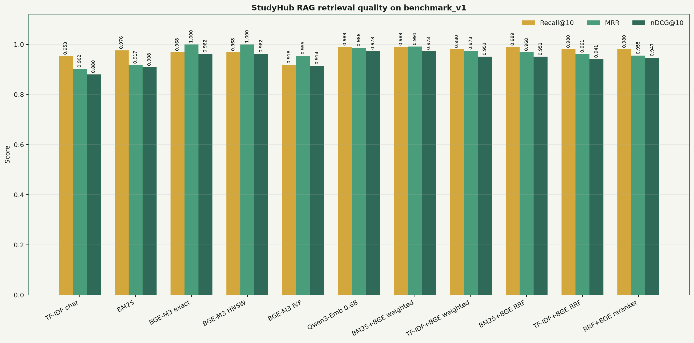
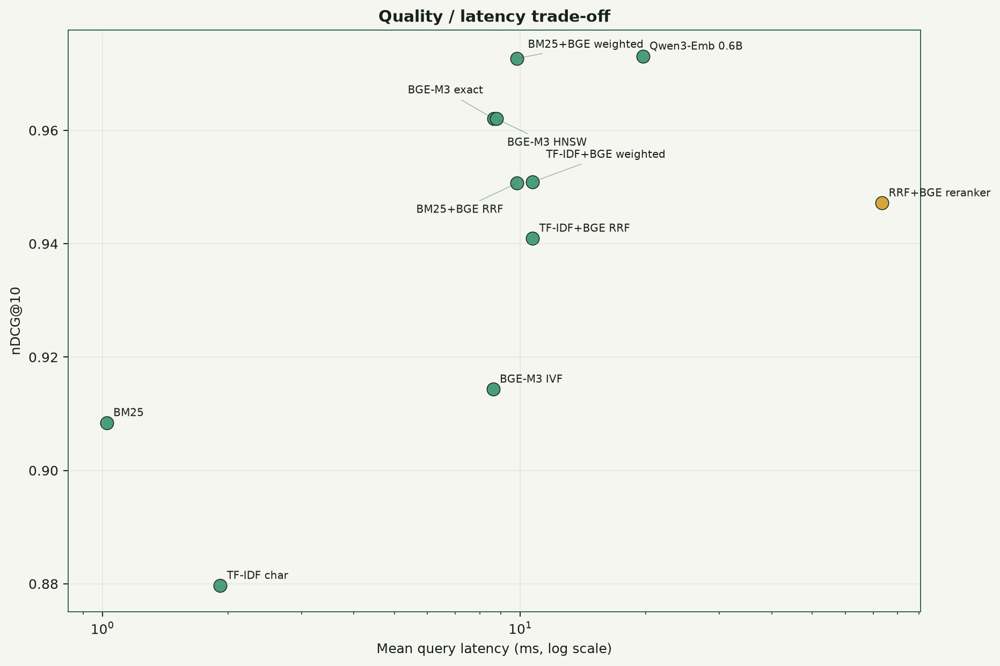
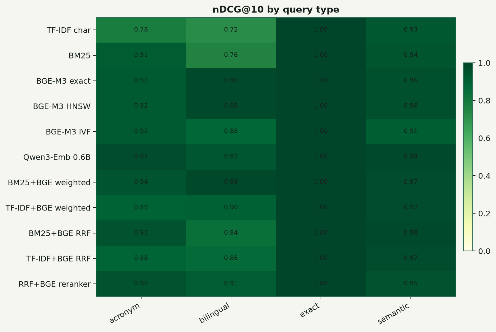

# StudyHub RAG 对比实验报告

> 生成时间：2026-07-16T09:36:10.669845+00:00  
> 定位：离线实验实现，不代表当前网站生产部署。

## 结论

当前 `benchmark_v1` 上，按 nDCG@10 排名最高的方法是 **qwen3_embedding_06b_exact**：Recall@10=0.9894，MRR=0.9864，nDCG@10=0.9731。

本实验把 `Interview_QA-CV` 中提到的 TF-IDF / BM25、BGE-M3、双路融合、RRF、ANN 与 Reranker 落实为可运行代码并做统一评测。StudyHub 当前生产搜索仍是字段包含匹配和人工权重；本目录没有接入生产 API。

## 数据与隔离

- 静态资料数：135，全部为免费公开资料。
- Chunk 数：517，其中元数据 Chunk 135，预览 OCR Chunk 382。
- 评测 Query：60，可回答 55，无答案 5。
- 输入只来自 `backup/oss_materials` 静态快照；代码不导入后端、不连接数据库、不读取 SQLite。
- 公开 API 快照没有保留 `files/<uuid>` 到 `material_id` 的映射，因此没有猜测关联原文件；文档证据使用可验证的 `materials/<id>/preview`。

## 总体指标

| 方法 | Recall@10 | Hit@10 | MRR | nDCG@10 | MAP@10 | 延迟 ms | 无答案 FPR | 权限泄漏 |
|---|---:|---:|---:|---:|---:|---:|---:|---:|
| qwen3_embedding_06b_exact | 0.9894 | 1.0000 | 0.9864 | 0.9731 | 0.9557 | 19.660 | 0.0000 | 0 |
| bm25_bge_weighted_06_04 | 0.9894 | 1.0000 | 0.9909 | 0.9727 | 0.9480 | 9.836 | 0.0000 | 0 |
| bge_m3_exact | 0.9682 | 1.0000 | 1.0000 | 0.9620 | 0.9290 | 8.650 | 0.0000 | 0 |
| bge_m3_hnsw | 0.9682 | 1.0000 | 1.0000 | 0.9620 | 0.9290 | 8.775 | 0.0000 | 0 |
| tfidf_bge_weighted_06_04 | 0.9803 | 1.0000 | 0.9733 | 0.9509 | 0.9252 | 10.714 | 0.0000 | 0 |
| bm25_bge_rrf | 0.9894 | 1.0000 | 0.9682 | 0.9507 | 0.9227 | 9.827 | 0.4000 | 0 |
| bm25_bge_rrf_bge_reranker | 0.9803 | 1.0000 | 0.9552 | 0.9472 | 0.9123 | 73.453 | 0.0000 | 0 |
| tfidf_bge_rrf | 0.9803 | 1.0000 | 0.9612 | 0.9409 | 0.9116 | 10.707 | 0.4000 | 0 |
| bge_m3_ivf | 0.9182 | 0.9636 | 0.9545 | 0.9143 | 0.8780 | 8.614 | 0.0000 | 0 |
| bm25_mixed_tokens | 0.9758 | 1.0000 | 0.9173 | 0.9084 | 0.8684 | 1.024 | 0.4000 | 0 |
| tfidf_char_2_4 | 0.9530 | 0.9636 | 0.9021 | 0.8797 | 0.8433 | 1.914 | 0.2000 | 0 |

## BGE-M3 索引对照

| 索引 | ANN Recall@candidate_k | 检索延迟 ms | 构建时间 ms | 索引大小 MB |
|---|---:|---:|---:|---:|
| bge_m3_exact | 1.0000 | 8.650 | 0.041 | 2.020 |
| bge_m3_hnsw | 0.9950 | 8.775 | 78.891 | 2.153 |
| bge_m3_ivf | 0.8921 | 8.614 | 365.016 | 2.055 |

## 图表







## 方法口径

- TF-IDF 使用字符 2-4 gram，BM25 使用中英文混合分词及中文 bigram。
- BGE-M3 与 Qwen3-Embedding-0.6B 使用本地权重和归一化向量；Qwen Query 使用模型内置 instruction。
- Exact、HNSW、IVFFlat 使用同一组 BGE-M3 向量，以便观察 ANN 的质量和速度差异。
- 加权融合先对每路分数做 min-max 归一化，再按词法 0.6 / 向量 0.4 合并。
- RRF 使用排名而非原始分数，默认 `k=60`；精排使用本地 `bge-reranker-v2-m3`。
- Chunk 结果先排序，再按 `material_id` 去重聚合，指标在资料级计算。

## 局限

`benchmark_v1` 是依据真实资料标题、标签和用途人工整理的第一版小型评测集，还不是由多位用户独立标注的金标集。无答案阈值使用可回答 Query 顶分的 P05 做初步校准，只能用于方法内诊断。后续应增加真实搜索日志、双人标注、冲突仲裁和按课程分层的置信区间。OCR 只覆盖公开预览页，无法代表原文件全部页内容。

## 复现

```bash
cd /data/chengjin/studyhub/studyhub-agent/ai_platform/rag_experiments
uv sync --extra dense --extra ocr --extra dev
uv run studyhub-rag verify-isolation
uv run studyhub-rag ocr-previews
uv run studyhub-rag build-corpus
uv run studyhub-rag run --mode all
uv run studyhub-rag verify-results
```
